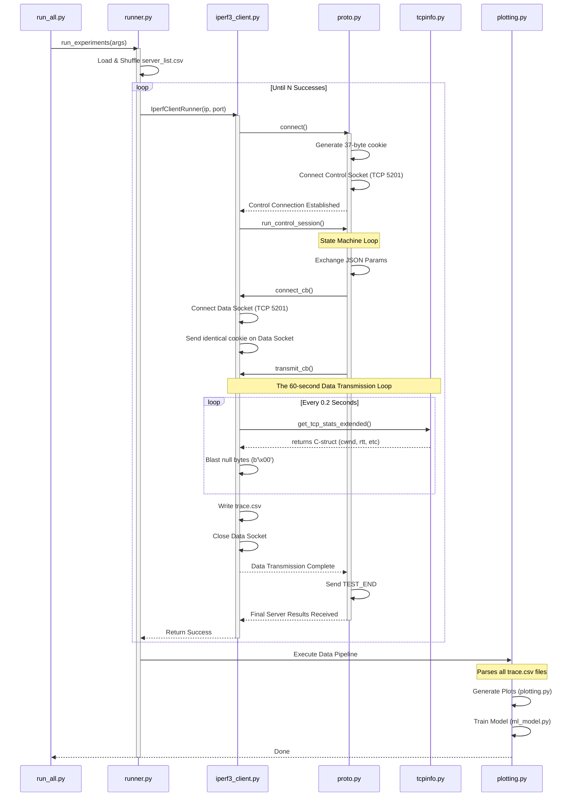

# Iperf3 Client Architecture & Control Flow

This document maps out the entire lifecycle of the assignment code, from the moment you hit "Enter" on your terminal to the final PDF and Markdown generation. 

## 1. System Architecture Flowchart

## 2. File-by-File Breakdown

### Phase 1: Orchestration
- **`run_all.py`**: The Entry Point. Uses `argparse` to read command-line arguments (e.g., `-n 10 --duration 60`) and immediately passes control to `runner.run_experiments()`.

- **`runner.py`**: The Target Manager. Parses `server_list.csv` and randomly shuffles it so tests hit a diverse set of global routing paths. It wraps the core test in a bulletproof `while` loop (with `try/except`). If a server is offline or drops the connection, it seamlessly logs the failure and moves to the next server IP until it legally captures exactly `n` traces.

### Phase 2: Protocol Handshake
- **`iperf3_client.py`**: The Engine. This file bridges the protocol state machine and raw data transmission. It instantiates `ClientProtocol` (`proto.py`).

- **`proto.py`**: The State Machine.
  - **Cookie Generation**: Generates 36 random characters + 1 null byte using `os.urandom`.
  - **Control Socket Setup**: Opens a standard TCP socket to the server IP on Port 5201, sending the cookie.
  - **State Loop**: Blocks on `read(1)` waiting for the server to dictate the current protocol state.
    - When the server demands parameters (`PARAM_EXCHANGE`), `proto.py` formats a JSON config file, packs its length into a 4-byte header, and sends it.
    - When the server issues `CREATE_STREAMS`, `proto.py` invokes a callback in `iperf3_client.py` to open the secondary **Data Socket** and send the identical cookie.
    - When the server sends `TEST_START`, `proto.py` fires the transmission callback.

### Phase 3: Data Transmission & Ingestion
- **`iperf3_client.py -> _transmit_data()`**: The heart of the experiment. An aggressive `while` loop attempts to push chunks of `16384` null bytes (`b'\x00'`) down the data socket.

- **`tcpinfo.py`**: The Native Kernel Bridge.
  - Every `0.2` seconds asynchronously, `iperf3_client` pauses transmission and invokes `get_tcp_stats_extended()`.
  - Uses `socket.getsockopt` requesting `TCP_INFO`, bypassing Python entirely to read the underlying Linux kernel memory structures tracking the socket state.
  - Formats `tcpi_snd_cwnd`, `tcpi_rtt`, and `tcpi_bytes_acked` into memory. 

### Phase 4: Finalizing & Reporting
- Once the timer pops, `iperf3_client` dumps the data to `trace.csv` and shuts down the Data Socket. `proto.py` sends `TEST_END`.

- **`plotting.py`**: The Visualizer. Kicks in after all tests pass. Parses all `trace.csv` files using `pandas`, generating Goodput histograms, time-series line graphs tracking CWND dropouts, and emitting `observations_notes.md`.

- **`ml_model.py`**: The Predictor. Ingests the `trace.csv` datasets sequentially. Manufactures lag features (like "Change in RTT") and attempts to accurately predict whether `cwnd` should grow adaptively or halve exponentially.
